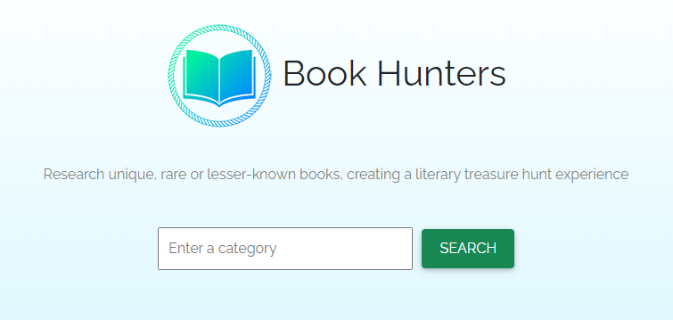
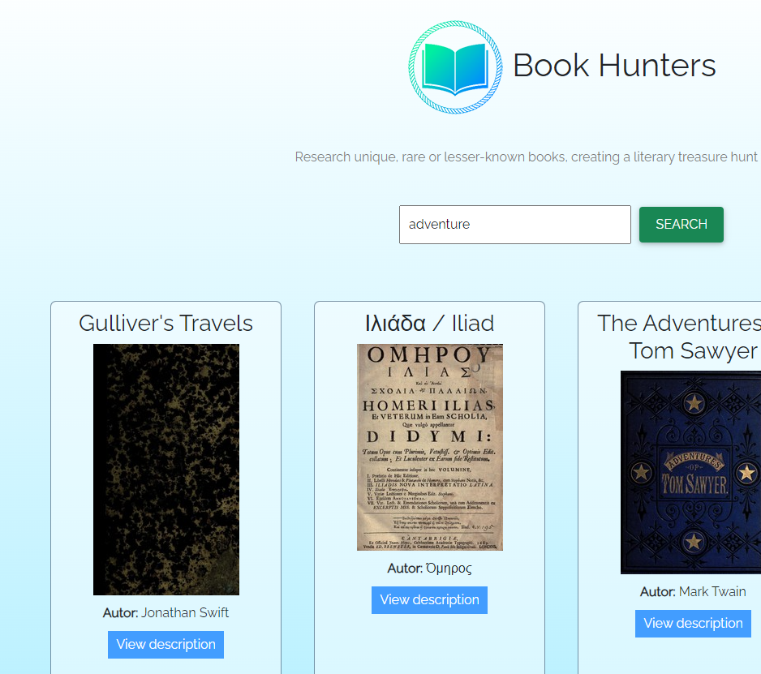

# Books Hunters :book:
This project is a web application that enables users to search and find books using a vast collection of titles, receiving the search results from the API OpenLibrary. The application is built using JavaScript as the main programming language, HTML for the website structure, and CSS for visual styling.

## How it works
Start writing a category you are looking for in the main search bar

a series of books related to the category you are looking for will be displayed.

## Languages
* HTML5
* CSS3
* Javascript ES6

## Libraries
* [Get from _Lodash](https://lodash.com/docs/4.17.15#get)
* [Axios](https://axios-http.com/)
* [Bootstrap](https://getbootstrap.com/) and [MBDBootstrap](https://mdbootstrap.com/) as an HTML and CSS framework I have opted for.

## Bundler
* [Webpack 5](https://webpack.js.org/)

## API
* [OpenLibrary API](https://openlibrary.org/developers/api)

## Installation
First of all, you need Node.js installed.
If you don't have it, you can download it here:
[Node.js](https://nodejs.org/it/download/) 
After the installation, you're ready to go.

### 1 - Clone the repository
`git clone link`
### 2 - Install the dependencies
`npm install`
### 3 - Build it!
`npm run build`

### 4 - Open in the browser
Check out for index.html in the /dist folder.

##  Try it!
Elsewhere, you can simply try it here:
[Best Cities To Live](https://bestcitiestolive.netlify.app/)

##  License
[MIT](https://choosealicense.com/licenses/mit/)

## Contact Me
My Email: edoardo.vitagliano3@gmail.com  
You can find my Linkedin profile here: https://www.linkedin.com/in/edoardo-vitagliano-299737110/
